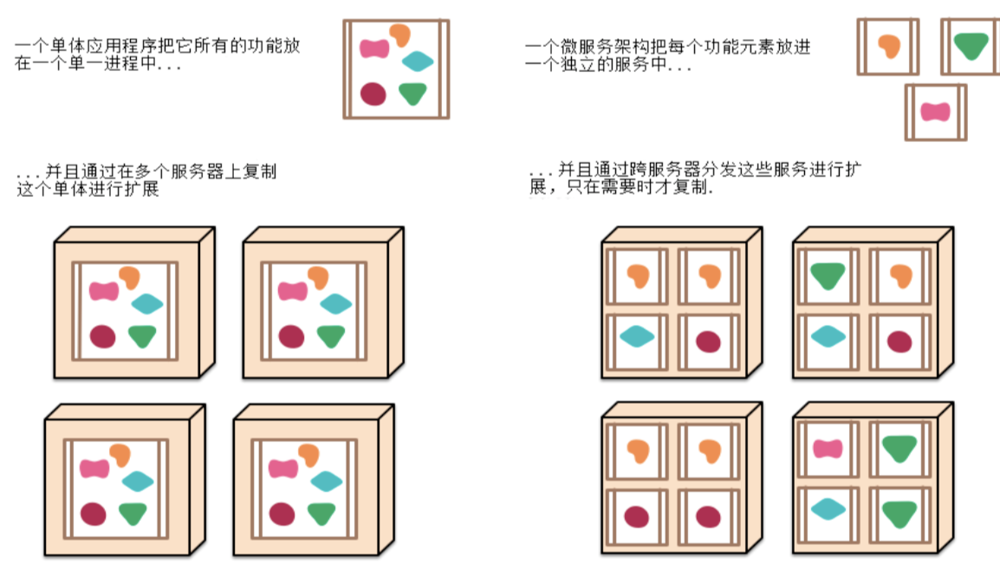
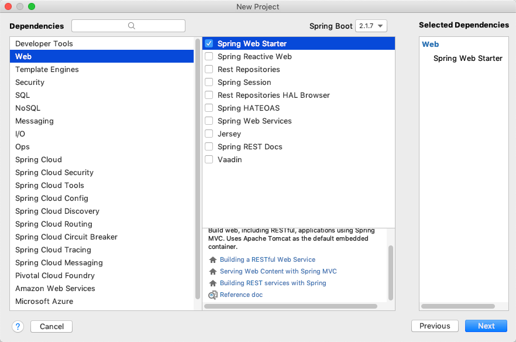

# SpringBoot第一篇入门笔记

## 入门

### 1 第一次了解

#### 1.1 SpringBoot的优势

1. <font color=red>springboot是对spring框架的再封装，用来简化Spring的开发</font>
2. 快速创建独立运行的Spring项目以及与主流框架集成
3. ==使用嵌入式的Servlet容器，应用无需打成WAR包== 直接打包成Jar包，直接使用jar -jar，不需要额外配置Tomcat等
4. starters自动依赖与版本控制
5. 大量的==自动配置==，简化开发，也可修改默认值
6. ==无需配置XML==，无代码生成，开箱即用
7. 准生产环境的运行时应用监控
8. 与云计算的天然集成

#### 1.2 Spring 微服务

微服务实际上是一种架构风格，<font color=red>它的中心思想是一组小型服务，以HTTP方式交互。</font>

每一个小型服务都是一个可独立替换、独立升级的服务单元。


原先的传统模式为单体应用，所有的服务都封装在一个war包里，这个带来的问题：

1. 日益增长的软件需求，不可能只有一个应用
2. 牵一发动全身，一旦修改某个小地方，所有服务都要停止重新打包



#### 1.3 第一个项目的搭建HelloWorld

1. 创建maven项目

2. 导入springboot的相关依赖,引入starters

   ==注意是继承了一个parent父工程的，`spring-boot-starter-parent`不是写在依赖中的==

   ```
   <!-- 指定Spring Boot的版本 2.0.4.RELEASE -->
   <parent>
       <groupId>org.springframework.boot</groupId>
       <artifactId>spring-boot-starter-parent</artifactId>
       <version>2.0.4.RELEASE</version>
   </parent>
   
   <dependencies>
      <!-- 导入Spirng Boot  web 所需的jar包 -->
       <dependency>
           <groupId>org.springframework.boot</groupId>
           <artifactId>spring-boot-starter-web</artifactId>
       </dependency>
   </dependencies>
   ```

   **说明：**

   1. 继承了一个父项目spring-boot-starter-parent，是所有spring-boot-starter的父项目，该项目实际上是继承了另外一个父项目

   ```
   <parent>
     <groupId>org.springframework.boot</groupId>
     <artifactId>spring‐boot‐dependencies</artifactId>
     <version>1.5.9.RELEASE</version>
     <relativePath>../../spring‐boot‐dependencies</relativePath>
   </parent>
   ```

   spring‐boot‐dependencies是真正管理Spring Boot应用里面的所有依赖版本的工程。

   父项目spring-boot-starter-parent的功能是Spring Boot的版本仲裁中心，导入依赖默认是不需要写版本;(没有在dependencies里面管理的依赖自然需要声明版本号)。

   2. <dependencies></dependencies>中导入的starter-xx才是真正场景启动器

      Spring Boot将所有的功能场景都抽取出来，做成一个个的starters(启动器)，只需要在项目里面引入这些starter，相关场景的所有依赖都会导入进来。

      要用什么功能就导入什么场景的启动器，相关的依赖jar包都会自动导入。

      [具体可见](https://docs.spring.io/spring-boot/docs/1.5.9.RELEASE/reference/htmlsingle/#using-boot-starter)

3. 创建主程序，启动SpringBoot

   ```java
   @SpringBootApplication
   public class StartApplication {
       public static void main(String[] args) {
           SpringApplication.run(StartApplication.class,args);
       }
   }
   ```

   **说明：**

   1. ==@SpringBootApplication: Spring Boot应用标注在某个类上说明这个类是SpringBoot的主配置类，SpringBoot就应该运行这个类的main方法来启动SpringBoot应用==
   2. 启动类不能在default包下，否则会报错
   3. 启动类从main函数开始运行，使用SpringApplication.run(StartApplication.class,args)`来加载SpringBoot

####  1.4 @SpringBootApplication初步了解

@SpringBootApplication其实是一个组合注解

```

@SpringBootConfiguration 
// @SpringBootConfiguration:Spring Boot的配置类; 标注在某个类上，表示这是一个Spring Boot的配置类;

@EnableAutoConfiguration
//开启自动配置功能;

@ComponentScan(
    excludeFilters = {@Filter(
    type = FilterType.CUSTOM,
    classes = {TypeExcludeFilter.class}
), @Filter(
    type = FilterType.CUSTOM,
    classes = {AutoConfigurationExcludeFilter.class}
)}
)
public @interface SpringBootApplication {
```

1. @SpringBootConfiguration Spring Boot的配置类

   ```
   @Configuration
   public @interface SpringBootConfiguration {
   }
   ```

   - @Configuration:配置类上来标注这个注解;配置类 ----- 配置文件;配置类也是容器中的一个组件

2. ==**@EnableAutoConfiguration**== 开启自动配置功能

   以前我们需要配置的东西，Spring Boot帮我们自动配置

   ```
   @AutoConfigurationPackage
   @Import(EnableAutoConfigurationImportSelector.class)
   public@interfaceEnableAutoConfiguration{
   ```

   - @AutoConfigurationPackage：将==主配置类==(@SpringBootApplication标注的类)==的所在包及下面所有子包里面的所有组件==扫描到Spring容器;

     - ```
       @Import({Registrar.class})
       public @interface AutoConfigurationPackage {
       }
       ```

     - @Import({Registrar.class})，<font color=red>**Import是Spring的底层注解，给容器中导入一个组件**</font>，这里导入的组件就是主配置类所在包和子包的所有全限定名组件

   - @Import(AutoConfigurationPackages.Registrar.class)，同样导入一些组件，==导入的组件是以xx.AutoConfiguration命名的自动配置类==，有了自动配置类，免去了我们手动编写配置注入功能组件等的工作。

#### 1.5 IDEA:使用 Spring Initializer快速创建项目 

IDE都支持使用Spring的项目创建向导快速创建一个Spring Boot项目，只需要选择我们需要的模块：



选择我们需要的模块;向导会联网创建Spring Boot项目;

默认生成的Spring Boot项目：

1. 主程序已经生成好了，我们只需要写自己的逻辑
2. resources文件夹中目录结构 
   1. static:保存所有的静态资源：js css images
   2. templates:保存所有的模板页面[Spring Boot默认jar包使用嵌入式的Tomcat，默认不支持JSP，可以使用模板引擎(freemarker、thymeleaf)解决]
   3. application.properties：Spring Boot应用的配置文件，可以修改一些默认设置; 

### 2 SpringBoot的配置

#### 2.1 配置文件

SpringBoot使用一个全局的配置文件，<font color=red>**配置文件名是固定的**</font>

- application.properties
- application.yml


##### YML 语法说明

**基本语法** 

1. k:<font color=red>**空格**</font>v    来表示一对键值对(空格必须有); 

2. 以空格的缩进来控制层级关系;只要是左对齐的一列数据，都是同一个层级的 

```
server: 
	port: 8081 
	path: /hello 
```

属性和值也是大小写敏感

**值的写法** 

1. **字面量:普通的值(数字，字符串，布尔)** 

   1.  <font color=red>**字符串默认不用加上单引号或者双引号**</font> 
   2. 双引号不会转义字符串里面的特殊字符，特殊字符会作为特殊字符代表的含义

   举例：name: "zhangsan \n lisi":输出;zhangsan 换行 lisi 

   3. 单引号会转义特殊字符，特殊字符最终只是一个普通的字符串数据
       举例：name: ‘zhangsan \n lisi’:输出;zhangsan \n lisi 

      

2. **对象、Map**
   【方法一】使用缩紧的方式在下一行来写对象的属性和值的关系

```
friends: 
	lastName: zhangsan 
	age: 20 
```

​		【方法二】行内写法: 

```
friends: {lastName: zhangsan,age: 18} 
```


3. **数组(List、Set)**: 

   【方法一】用- 值表示数组中的一个元素 

   ```
   pets:
    ‐cat
    ‐dog
    ‐pig
   ```

   【方法二】行内写法 

```
pets: [cat,dog,pig] 
```


#### 2.2 配置文件注入案例

##### 2.0 导入配置文件处理器依赖

```
<!‐‐导入配置文件处理器，配置文件进行绑定就会有提示‐‐> 
        <dependency>
            <groupId>org.springframework.boot</groupId>
            <artifactId>spring‐boot‐configuration‐processor</artifactId>
            <optional>true</optional>
        </dependency>
```

不导入并不会出错，只是没有提示不方便开发

##### 2.1 JavaBean的@ConfigurationProperties

`@ConfigurationProperties(prefix)`

1. 告诉SpringBoot将本类中的所有属性和配置文件中相关的配置进行绑定
2. prefix = "xx"，将和配置文件中<font color=red>key值为xx</font>下面的所有属性进行一一映射 

3. <font color=red>**只有这个组件是容器中的组件，才能容器提供的@ConfigurationProperties功能，所以还需要@Component加入容器**</font>

```java
@Component
@ConfigurationProperties("person")
public class Person {

    private String name;
    private Integer age;
    private Map<String,Object> maps;
    private List<Object> list;
    private Dog dog;
}
```

<font color=red>**此外还需要生成get/set方法**</font>

@AutoWired是使用get/set方法注入的，不写get/set方法是没有办法自动注入的

##### 2.2 yaml配置文件

```yaml
# demo1中的Person类注入
person:
  name: 张三
  age: 18
  maps: {k1: v1,k2: v2}
  list: [list1,list2,list3]
  dog: {dogName: dog,dogAge: 3,dogMaps: {dogk1: dogv1,dogk2: dogv2},doglist: [doglist1,doglist2,doglist3]}
```

##### 2.3 SpringBootTest

在test下生成了一个SpringBoot的单元测试

```java
package cn.cst.springbootstudy;

import org.junit.Test;
import org.junit.runner.RunWith;
import org.springframework.boot.test.context.SpringBootTest;
import org.springframework.test.context.junit4.SpringRunner;

@RunWith(SpringRunner.class)
@SpringBootTest
public class SpringbootStudyApplicationTests {

    @Test
    public void contextLoads() {
    }

}
```

主要是两个注解：

1. 
   @SpringBootTest：表明是SpringBoot的单元测试
2. @RunWith(SpringRunner.class)：使用Spring的驱动测试，而非普通的JVM，可以在测试期间使用容器自动注入@Autowired等功能


在此部分进行单元测试：

```java
public class SpringbootStudyApplicationTests {

    @Autowired
    Person person;
    @Test
    public void contextLoads() {
        System.out.println(person.toString());
    }

}
```

